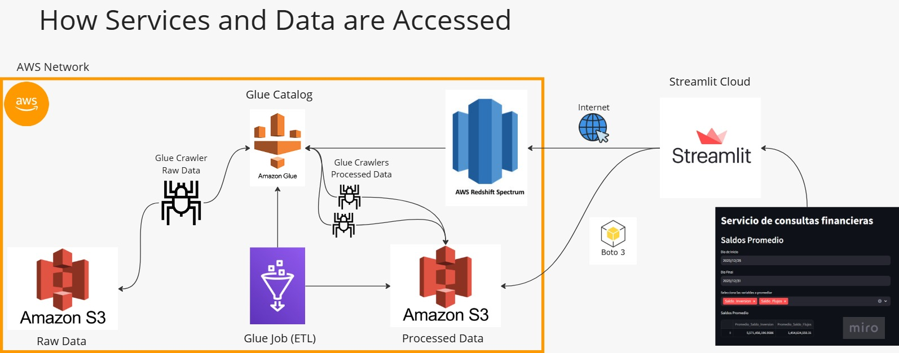
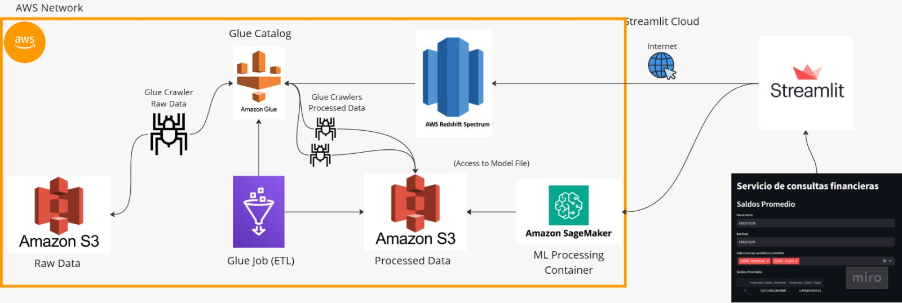
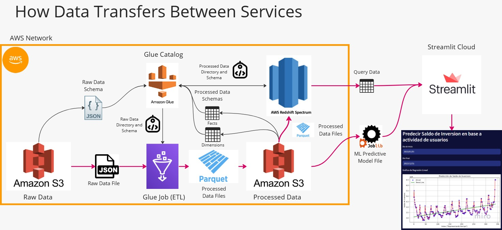
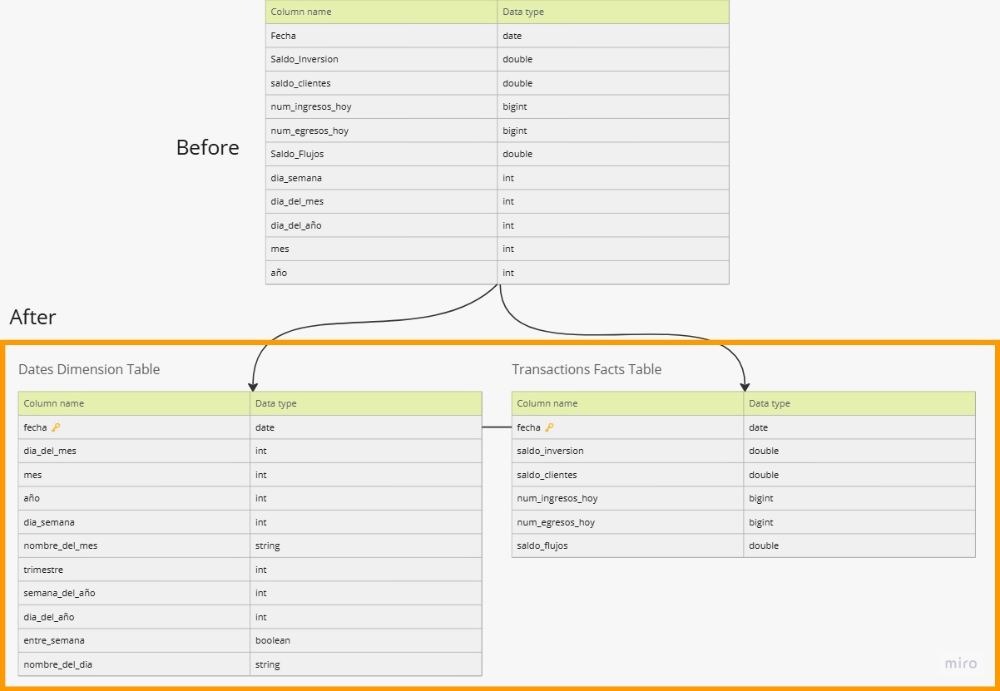
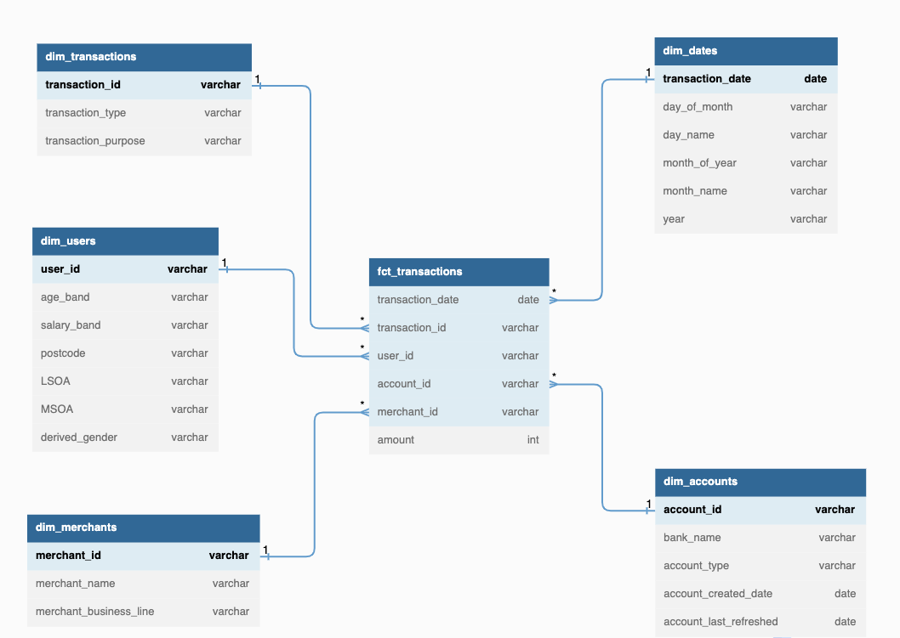

# Servicio de consultas financieras
(Financial Data Analysis Platform by Noe Lozano Mendoza)

## Table of Contents
1. [Introduction](#introduction)
2. [Architecture](#architecture)
   - [High-Level Architecture](#high-level-architecture)
   - [Alternative Architecture](#alternative-architecture)
3. [Data Flow and Transformation](#data-flow-and-transformation)
4. [Data Model](#data-model)
5. [Setup and Installation](#setup-and-installation)
6. [Scalability and Performance](#scalability-and-performance)

## Introduction
The "Servicio de consultas financieras" solution is designed to process and analyze financial metrics such as average balances, in-transit balances, historical comparisons, and predictions of investment balances. The application uses AWS services to create a highly scalable, efficient, and secure data processing pipeline, and streamlit to allocate the web app which will be conecting to AWS services to aquire the user's requested data.

## Architecture
### High-Level Architecture
The primary architecture works with the following AWS services:


**AWS Network**
**Amazon S3 (Raw Data):**

- ***Role***: Amazon S3 serves as the initial storage for raw financial data.
- ***Functionality***: Raw data from various sources is uploaded to an S3 bucket. S3 provides durable, highly available, and scalable storage.

**AWS Glue Crawler (Raw Data):**

- ***Role***: AWS Glue Crawlers are used to automatically discover and catalog the raw data stored in S3.
- ***Functionality***: The Glue Crawler scans the raw data, infers its schema, and creates metadata tables in the Glue Data Catalog. This step prepares the data for ETL (Extract, Transform, Load) operations.

**AWS Glue Catalog:**

- ***Role***: Centralized metadata repository.
- ***Functionality***: The Glue Catalog stores the metadata created by the Glue Crawlers. It serves as a reference for data schemas, making it easier to manage and query the data.

**AWS Glue Job (ETL):**

- ***Role***: Transform raw data into a structured format.
- ***Functionality***: The Glue ETL (Extract, Transform, Load) job processes the raw data according to predefined transformations and loads the processed data into another S3 bucket. 

**Amazon S3 (Processed Data):**

- ***Role***: Store transformed and processed data. (And avoids single point fo failure stoaraging everything in a single S3 bucket)
- ***Functionality***: The processed data is stored in a separate S3 bucket. This structured data is optimized for querying and analysis.

**AWS Glue Crawlers (Processed Data):**

- ***Role***: Catalog processed data.
- ***Functionality***: Similar to the raw data crawlers, these crawlers scan the processed data, infer its schema, and update the Glue Data Catalog with the new metadata.

**AWS Redshift Spectrum:**

- ***Role***: Query processed data stored in S3.
- ***Functionality***: Redshift Spectrum allows you to run SQL queries directly on the processed data stored in S3 without having to load it into an Amazon Redshift data warehouse. This decision provides a lower deployment cost since bucket storage is considerably lower than Redshift storage, while mantaining the power of its clusters. 

**Boto 3:**

- ***Role***: Interface to interact with AWS services.
- ***Functionality***: Boto 3 is the AWS SDK for Python, allowing the Streamlit application to interact with AWS services. It can be used to trigger Glue Jobs, query data using Redshift Spectrum, and perform other AWS operations. In this case, used to obtain the trained model from S3.

**Streamlit Cloud:**

- ***Role***: Provide a user interface for data visualization.
- ***Functionality***: Streamlit is used to create a web application that provides a user-friendly interface for querying and visualizing financial data. Users can input their query parameters, and Streamlit will display the results in an interactive format.

### Alternative Architecture
This architecture includes Amazon SageMaker for machine learning model processing.



**Pros and Cons:**
- **Pros**: Adds machine learning capabilities, scalable, efficient for data processing and model deployment.
- **Cons**: Higher cost, more complex setup.

## Data Flow and Transformation

**Data Ingestion:**
- Raw data is uploaded to an S3 bucket.

**Data Cataloging:**
- AWS Glue Crawlers scan the raw data, infer schemas, and create metadata in the Glue Data Catalog.

**ETL Processing:**
- AWS Glue Jobs transform the raw data into a structured format and store it in a separate S3 bucket.

**Processed Data Cataloging:**
- AWS Glue Crawlers scan the processed data and update the Glue Data Catalog.

**Data Querying:**
- AWS Redshift Spectrum queries the processed data stored in S3.

**Data Visualization:**
- Streamlit provides a frontend for users to interact with and visualize the data, making API calls via Boto 3 to AWS services for loading the predictive model.


## Data Model


### Before: Original Schema
The original schema consists of a single table with various columns capturing different aspects of the financial data:

- **Columns**: Fecha (date), Saldo_Inversion (double), saldo_clientes (double), num_ingresos_hoy (bigint), num_egresos_hoy (bigint), Saldo_Flujos (double), dia_semana (int), dia_del_mes (int), dia_del_año (int), mes (int), año (int).

This schema captures both transactional and dimensional data in a single table, which can lead to redundancy, slower query performance, and difficulty in scaling as the data grows.

### After: Star Schema
To improve analytical performance and scalability, the original schema is transformed into a star schema, consisting of a central fact table and related dimension tables:

1. **Dates Dimension Table**:
   - **Columns**: 
     - `fecha` (date): Primary key.
     - `dia_del_mes` (int)
     - `mes` (int)
     - `año` (int)
     - `dia_semana` (int)
     - `nombre_del_mes` (string)
     - `trimestre` (int)
     - `semana_del_año` (int)
     - `dia_del_año` (int)
     - `entre_semana` (boolean)
     - `nombre_del_dia` (string)
   - **Purpose**: This table captures all date-related attributes, making it easier to perform date-based analysis and aggregations.

2. **Transactions Facts Table**:
   - **Columns**: 
     - `fecha` (date): Foreign key referencing the Dates Dimension Table.
     - `saldo_inversion` (double)
     - `saldo_clientes` (double)
     - `num_ingresos_hoy` (bigint)
     - `num_egresos_hoy` (bigint)
     - `saldo_flujos` (double)
   - **Purpose**: This table captures the transactional metrics and is linked to the Dates Dimension Table through the `fecha` key, enabling efficient querying and reporting.

By transforming the original schema into a star schema, the data model is optimized for analytical performance, future scalability, and ease of integration, aligning with best practices for data warehousing.


## Setup and Installation
1. Clone the repository.
   ```bash
   git clone https://github.com/your-repo/financial-data-analysis-platform.git
   cd financial-data-analysis-platform```
2. Initialize Terraform.
    ```terraform init```
3. Configuration
    - Create a terrafrom.tfvar within the 'infra' folder with the values of the
    the variables declared in 'variables.tf'
    - Ensure your AWS credentials and Files routes are properly configured.

4. Apply the Terraform configuration.
    ```terraform apply```

5. After apply, services must be run in the following order. (Manually or automatically with extra configuration donde thorugh Terraform or the AWS Managment Console).
    - Run raw_data crawler
    - Run ETL Job to create new processed data
    - Run date and transactions crawler
    - Note: For some reason, sometimes, IAM role for Redshift is not being assigned automatically via terraform. In AWS Management Console access to the created cluster in Redshift and assgined the arn of the policy in Cluster Details->Resource Policy.
    - Create external tables in Query Editor (I recommend v2). Using the following queries (**Modify**):
    ```CREATE EXTERNAL SCHEMA spectrum_schema
    FROM DATA CATALOG
    DATABASE 'glue-databse'
    IAM_ROLE 'arn:aws:iam::userID:role/redshift-role';
    
    CREATE EXTERNAL TABLE spectrum_schema.transactions (
    fecha DATE,
    saldo_inversion DOUBLE PRECISION,
    saldo_clientes DOUBLE PRECISION,
    num_ingresos_hoy INT,
    num_egresos_hoy INT,
    saldo_flujos DOUBLE PRECISION
    )
    STORED AS PARQUET
    LOCATION 's3://bucket/fact/transactions/';```
6. After configuring services in AWS. Submit your streamlit code to streamlit cloud. Here is the tutorial: [*Deploy your app on Streamlit Community Cloud*](https://docs.streamlit.io/deploy/streamlit-community-cloud/deploy-your-app)
Don't forget to add your credentials:[*Connect Streamlit to AWS S3*](https://docs.streamlit.io/develop/tutorials/databases/aws-s3)
7. Don't forget to submit your .joblib trained model to S3! There is an example of a simple trend prediction model in 'infra' model.

### 🎉THAT'S IT.🎉 
Your appplication and AWS services are deployed.

## Scalability and Performance
### Amazon S3 (Simple Storage Service)
- **Storage Scalability**: Amazon S3 is inherently scalable and can handle virtually unlimited amounts of data. As your data grows, S3 can automatically scale to accommodate this growth without any manual intervention.
- **Performance**: S3 provides high throughput, low latency, and high durability, making it suitable for storing large datasets and supporting high-frequency read and write operations.
### AWS Glue
- **Glue Crawlers**: AWS Glue crawlers can automatically detect changes in your data schema and update the Glue Data Catalog accordingly. This automation reduces the need for manual schema management as the volume of data increases.
- **ETL Jobs**: AWS Glue can scale its ETL (Extract, Transform, Load) jobs by distributing the processing across multiple nodes since it is implemented using Spark. This parallel processing capability allows Glue to handle large data volumes and complex transformations efficiently.
### AWS Redshift Spectrum
- **Query Scalability**: Redshift Spectrum allows you to run queries on data stored in S3 without having to move it into Redshift. This separation of storage and compute enables you to scale your query processing independently of your storage capacity.
- **Elasticity**: Redshift can scale the number of nodes in your cluster up or down based on the workload. This elasticity ensures that you have the right amount of compute resources available to handle peak query loads.
### Amazon SageMaker (Alternative Architecture)
- **Model Training and Deployment**: SageMaker can automatically scale the compute resources used for training machine learning models based on the data size and complexity of the model. For deployment, SageMaker endpoints can scale horizontally to handle more prediction requests.
- **Batch Transform Jobs**: For large datasets, SageMaker batch transform jobs can distribute the processing across multiple instances, ensuring efficient handling of bulk predictions.


